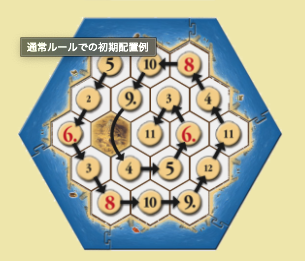
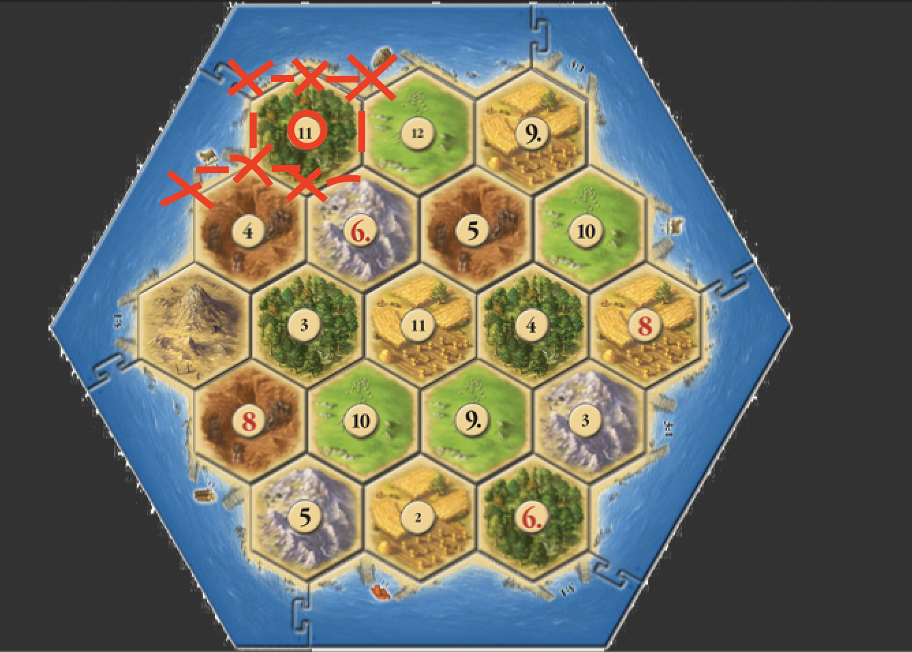

# 設計に必要なタスク

- [ ] マップの設計

## マップの設計

どのように実装すれば再現可能か？
マップの実装方法をいくつか参考にした結果
ヘクスマップ,座標系の内容にヒット

今後の処理も考え、なるべく規則的な座標を表現


参照：「日本カタン協会」公式ページ
<https://catan.jp/guide/>

座標の設計を優先して、数値トークンは座標に合わせて成形処理加える


x   :   開拓地,街 設置可能箇所
-,| :   道 設置可能箇所
n   :   数値トークン配置箇所

```
                    x   -   x   -   x   -   x   -   x   -   x   -   x
                    |       n       |       n       |       n       |
            x   -   x   -   x   -   x   -   x   -   x   -   x   -   x   -   x
            |       n       |       n       |       n       |       n       |
    x   -   x   -   x   -   x   -   x   -   x   -   x   -   x   -   x   -   x   -   x
    |       n       |       n       |       n       |       n       |       n       |
    x   -   x   -   x   -   x   -   x   -   x   -   x   -   x   -   x   -   x   -   x
            |       n       |       n       |       n       |       n       |
            x   -   x   -   x   -   x   -   x   -   x   -   x   -   x   -   x
                    |       n       |       n       |       n       |
                    x   -   x   -   x   -   x   -   x   -   x   -   x
```
